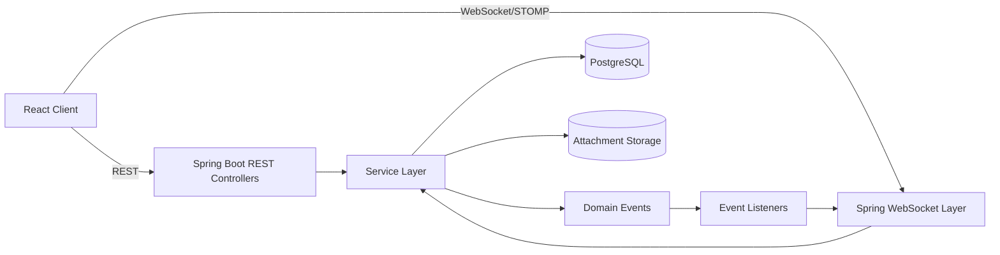
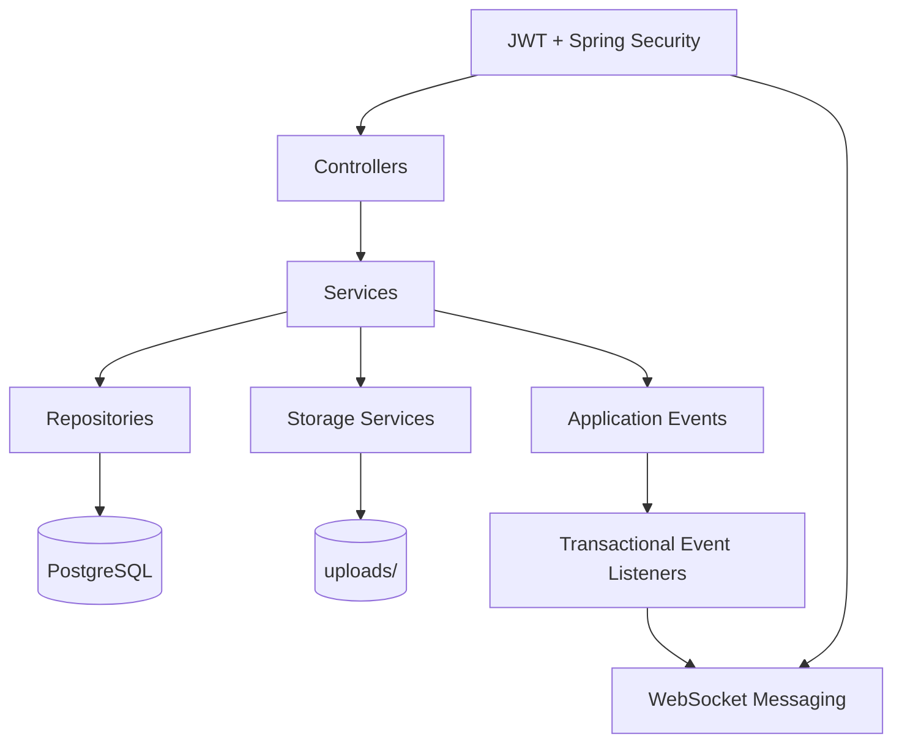
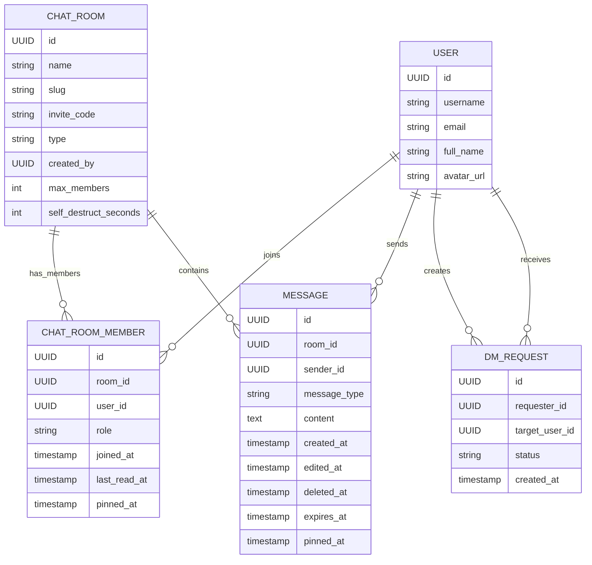
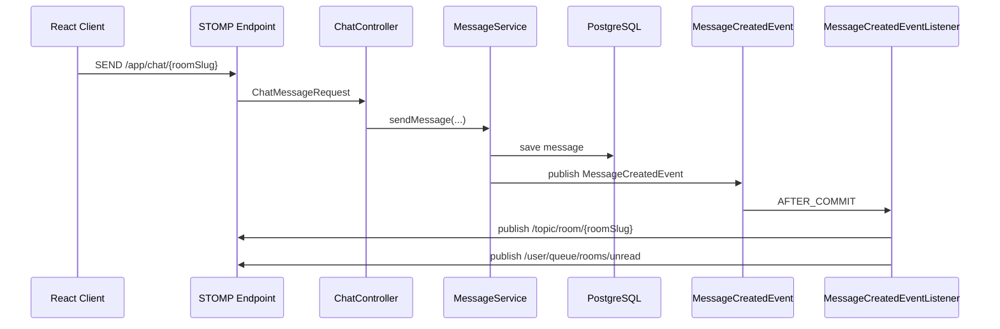

# Whisprly Architecture

## 1. System Overview

Whisprly is a single-backend real-time chat system with:

- Spring Boot backend
- PostgreSQL as the source of truth
- WebSocket/STOMP for realtime delivery
- React frontend using REST for fetch/update flows and WebSocket for live updates

Internal persistence uses UUIDs, while public-facing interactions use usernames, room slugs, and invite codes.

## 2. High-Level Architecture

## 3. Backend Layers

### Controllers

Responsibilities:

- expose REST endpoints under `/api/**`
- expose STOMP app destinations for realtime sends
- resolve authenticated user context
- delegate business rules to services

Main controllers:

- `AuthController`
- `ChatRoomController`
- `MessageController`
- `ChatController`
- `DmRequestController`
- `UserController`

### Services

Responsibilities:

- enforce authorization and membership rules
- manage room, DM, and message lifecycle
- compute unread state
- resolve public IDs to internal entities
- persist domain state
- publish domain events after core writes

Important services:

- `ChatRoomService`
- `MessageService`
- `DmRequestService`
- `RoomPublicIdService`

### Repositories

Spring Data JPA repositories back:

- users
- rooms
- memberships
- messages
- DM requests

They include queries for:

- membership checks
- room lookup by slug / invite code
- user lookup by username
- unread count calculation
- room/global message search
- expired message fetch

## 4. Public Identifier Strategy

Whisprly intentionally separates persistence IDs from public IDs.

### Users

- internal key: `UUID`
- public identifier: `username`

Used in:

- profile summary lookup
- DM request creation
- DM room creation

### Rooms

- internal key: `UUID`
- public identifier: `slug`
- shareable join token: `inviteCode`

Used in:

- room routes
- room message APIs
- room settings routes
- WebSocket room topics
- join-room flow

This improves UX while preserving stable database relations.

## 5. Core Domain Model

## 6. Event-Driven Flow

Whisprly uses Spring application events to separate core writes from side effects.

### Events in use

- `MessageCreatedEvent`
- `DmRequestCreatedEvent`
- `RoomUpsertedEvent`

### Listeners in use

- `MessageCreatedEventListener`
- `DmRequestCreatedEventListener`
- `RoomUpsertedEventListener`

### Why this matters

This avoids packing every side effect into controller/service methods directly.

Examples:

- message creation persists first, then listeners broadcast room messages and unread updates
- DM request creation persists first, then listeners push the request to the target user queue
- room mutations publish room upsert events, then listeners push per-user room summaries to room-update queues

## 7. Realtime Messaging Model

## 8. Realtime Channels

### Room-scoped

- `/topic/room/{roomSlug}`
- `/topic/room/{roomSlug}/typing`

### User-scoped

- `/user/queue/rooms/unread`
- `/user/queue/rooms/updates`
- `/user/queue/dm-requests/incoming`
- `/user/queue/presence`

### Shared

- `/topic/presence/snapshot`

## 9. Key Runtime Flows

### A. Send Message

1. Client sends message through STOMP using room slug.
2. Backend validates membership and room policy.
3. Message is saved.
4. `MessageCreatedEvent` is published.
5. Listener broadcasts the message to the room topic.
6. Listener computes unread counters and pushes per-user unread updates.

### B. Join Room by Invite Code

1. Client submits invite code.
2. Backend resolves invite code to room UUID.
3. Membership is created.
4. A system message is created: `username joined the room`.
5. `RoomUpsertedEvent` pushes refreshed room summaries to relevant users.

### C. Create DM by Username

1. Client submits target username.
2. Backend resolves username to target user UUID.
3. Existing DM is returned or a new DM room is created.
4. `RoomUpsertedEvent` pushes the room to both users.

### D. DM Request Flow

1. Client sends DM request by username.
2. Backend persists `DmRequest`.
3. `DmRequestCreatedEvent` is published.
4. Listener pushes the request to the target user queue.
5. Frontend updates local request state and shows a toast.

### E. Mark Room Read

1. Client opens a room and calls mark-read.
2. Backend updates `chat_room_members.last_read_at`.
3. Backend returns unread count `0`.
4. User-specific unread queue stays in sync with later events.

### F. Message Search and Jump

1. Client searches globally or inside a room.
2. Backend runs scoped search query.
3. Result selection sets jump target in frontend state.
4. UI opens the room, fetches the target if necessary, scrolls, and highlights it.

## 10. Message Lifecycle

Messages support:

- text messages
- attachment messages
- edited messages
- soft-deleted messages
- pinned messages
- self-destruct messages
- system messages

### System messages

Whisprly uses `messageType = SYSTEM` for timeline events such as room joins.

This keeps join notices inside the conversation stream without mixing them with user-authored notifications.

## 11. Frontend Architecture

The frontend is organized by features:

- `auth`
- `chat`
- `rooms`
- `profile`
- `presence`
- `notifications`

State is handled with Zustand stores:

- auth store
- room store
- chat store
- presence store
- DM request store
- toast store

### Frontend behavior

- REST loads initial room/message/profile state
- WebSocket subscriptions keep room messages, unread counters, room lists, presence, and DM requests updated in real time
- Toast notifications surface new messages, room updates, and DM requests

## 12. Security Boundaries

- JWT secures REST endpoints
- authenticated identity is used for WebSocket sessions
- room membership is checked before message/history access
- role rules protect room management actions
- attachment validation runs before storage

## 13. Storage and Attachments

Attachments are:

- validated by category / content type
- stored through the storage service
- referenced from messages through attachment metadata
- retrieved through authenticated message attachment endpoints

## 14. Current Tradeoffs

- PostgreSQL is the single source of truth
- domain events are in-process Spring events, not an external broker
- realtime scaling across multiple backend instances would still need distributed coordination if the project grows

That tradeoff is intentional for the current project size: it keeps the architecture clean without adding infrastructure complexity too early.
