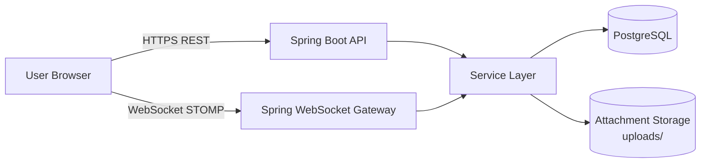
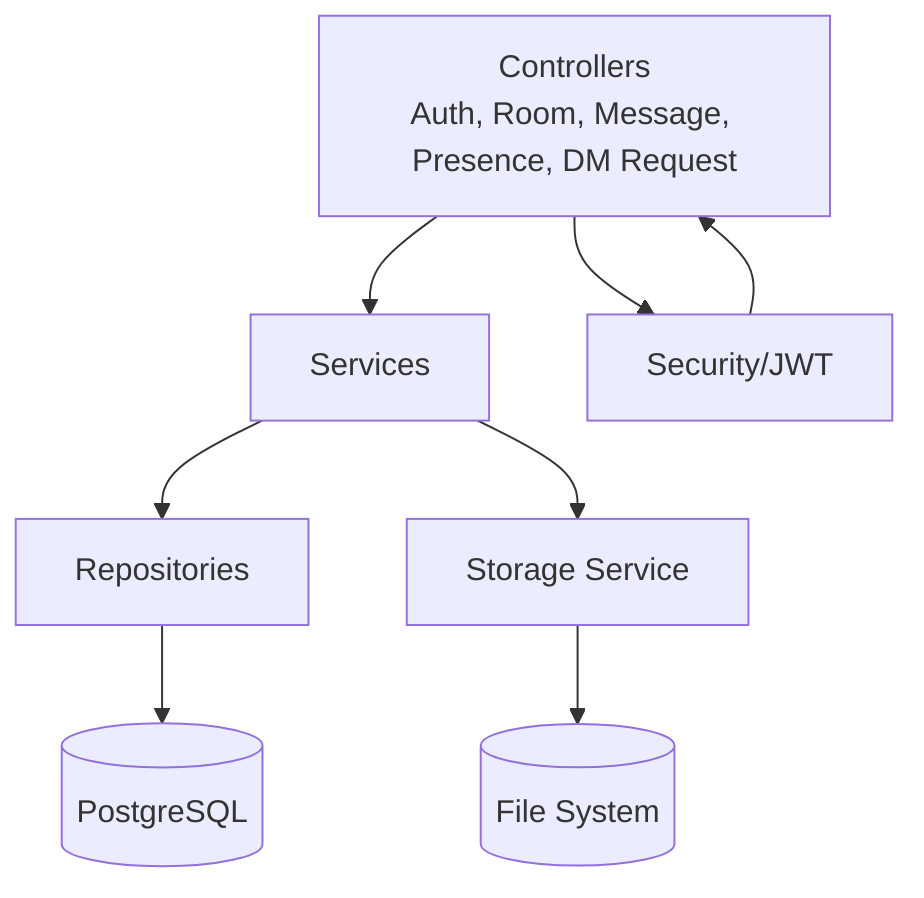
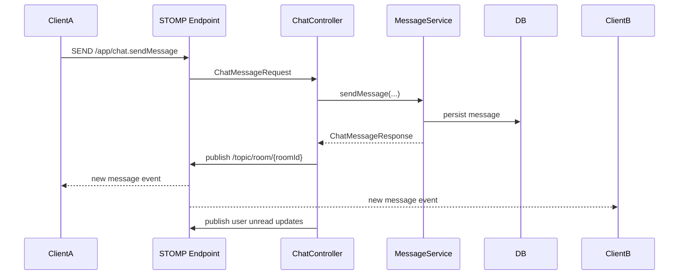
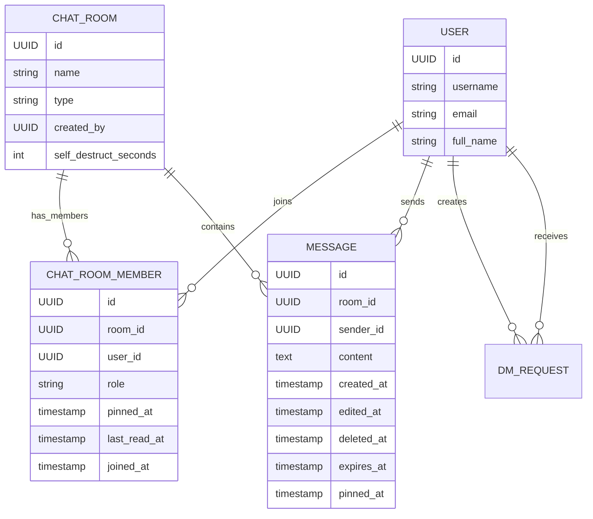

# Whisprly Architecture

## 1. System Context

## 2. Backend Layered Architecture

### Controller Layer
- Exposes REST endpoints under `/api/**`.
- Handles authenticated user context via Spring Security.
- Publishes real-time events via `SimpMessagingTemplate`.

### Service Layer
- Core business logic:
  - room/DM lifecycle
  - message send/edit/delete/pin
  - unread tracking (`lastReadAt` baselines)
  - self-destruct expiration handling
  - membership and authorization checks

### Repository Layer
- Spring Data JPA repositories for `User`, `ChatRoom`, `ChatRoomMember`, `Message`, `DmRequest`.
- Query methods include:
  - room membership checks
  - unread count calculations
  - message history + search (global and room scoped)
  - expired-message fetch for cleanup

## 3. Real-Time Messaging Architecture

### WebSocket Topics/Queues (logical)
- Room broadcast: `/topic/room/{roomId}`
- Typing events: room-topic events
- User-specific unread updates: `/user/queue/rooms/unread`
- Presence snapshots/updates: presence channels

## 4. Data Model (Core)

## 5. Key Runtime Flows

### A) Fetch Rooms + Unread
1. Client calls room listing API.
2. Service loads memberships for current user.
3. Unread count computed using `lastReadAt` (fallback baseline) and message timestamps.
4. Response includes room metadata + `unreadCount`.

### B) Mark Room Read
1. Client opens a room and calls mark-read endpoint.
2. Backend updates `chat_room_members.last_read_at`.
3. Backend pushes unread update to that user queue.

### C) Pinned Message Banner
1. Message pin/unpin updates message state (`pinned_at`, `pinned_by`).
2. Updated message broadcast to room in real time.
3. UI derives current pinned message and renders top banner.

### D) Self-Destruct Messages
1. Room setting defines `selfDestructSeconds`.
2. New messages get `expires_at` at creation time.
3. Scheduler finds due messages and marks them expired/deleted.
4. Expired updates are propagated to clients.

### E) Message Search
1. Global search endpoint scans user-accessible messages.
2. Room search endpoint scans only selected room.
3. Result selection sets jump target (room + message).
4. UI opens room, scrolls to exact message, and highlights it.

## 6. Security Boundaries
- JWT authentication for REST + WebSocket session identity.
- Membership checks before room/message access.
- Role-based restrictions for room management operations.
- Attachment validation before storage and retrieval.

## 7. Module Map
- Backend: `src/main/java/com/chatapp`
  - `controller/`, `service/`, `repository/`, `model/`, `dto/`, `security/`, `storage/`
- Backend config/resources: `src/main/resources`
- Frontend UI/client state: `frontend/src`

